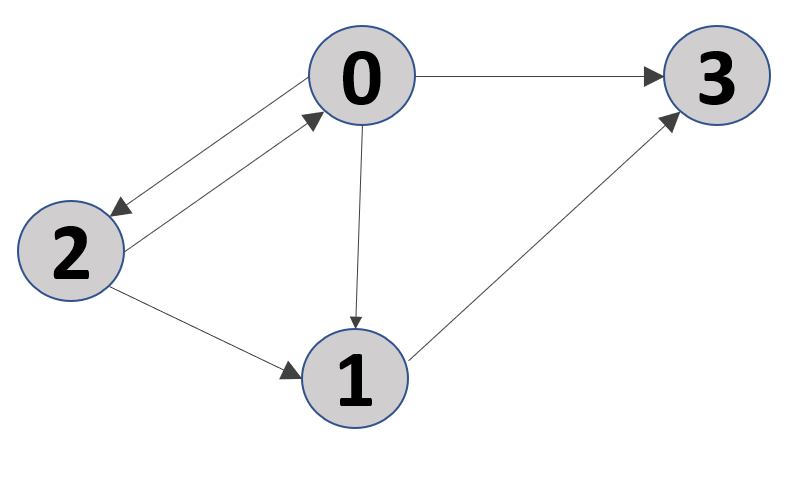
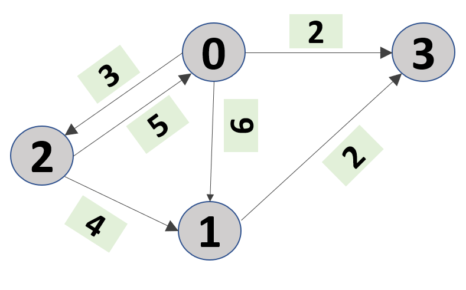

# Problems-CPP
Some key problems in C++

## Problem-1

In this problem we write a simple BFS graph traversal to find all the possible paths from a `source` node to a `goal` node. The edges of the graph are unweighted. Further the connections of different nodes are presented as an array of vectors named `adj` in the code. Please see the code named `AllPaths_UnweightedGraph.cpp`.

## Problem-2

Here we find all the paths of an weighted graph. In this code, we represent the adjacency list is represented as array of vectors. The `i-th` element of the array is a vector. Each element of this vector is a pair. The `first` element of the pair is the node index (say `j`) connected to node `i` and the second element is the weight of the edge `i->j`. Please see the code named `AllPaths_WeightedGraph.cpp`.
